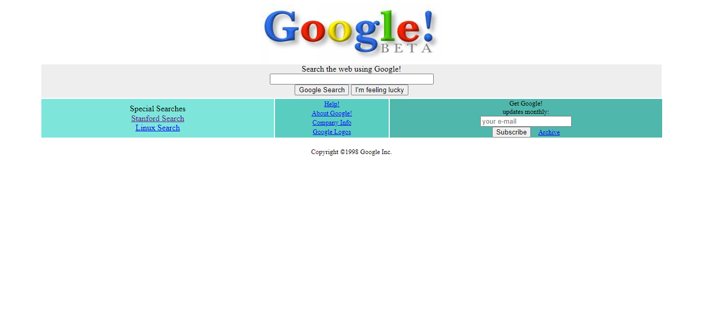

# 1998 Google Web Sitesinin Tasarımı
- Patika.dev'in CSS dersinin 2. ödevi Google web sitesinin eski tasarımını en basit ve yapısal olmayan yoldan yaptım.

- Table, font, input vb. tag'ler ile yapılmış hali
[link]](https://github.com/mucahitdogan1/kodluyoruz-css-odev2-badmethod/tree/secondmethod)